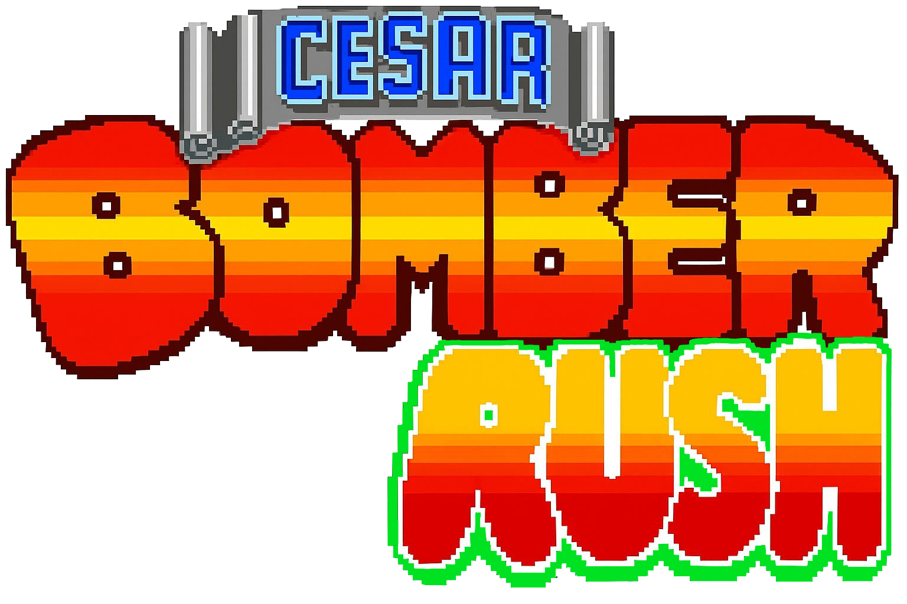
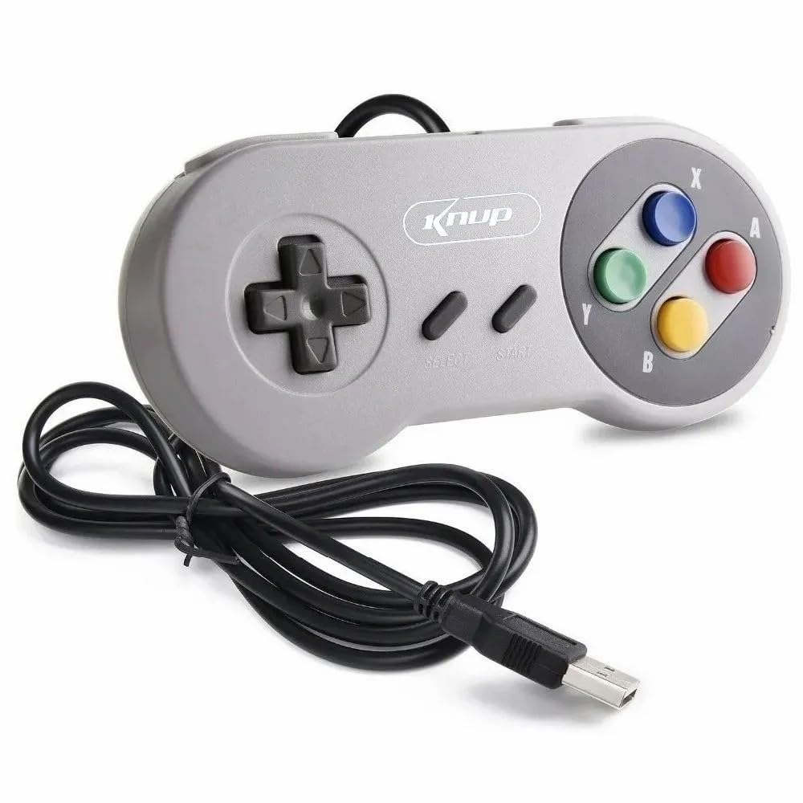
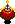
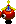
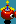
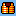
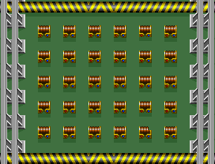
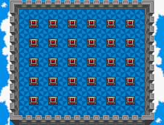
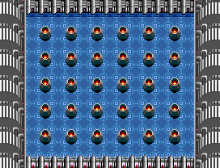

# 💣 Bomber Rush

  

# 💥 Bomber Rush

**Bomber Rush** é um modo original inspirado no clássico *Bomberman*, desenvolvido em **C** utilizando a biblioteca gráfica **Raylib** e com suporte a controles através da **SDL2**.

O jogo coloca **1 a 4 jogadores** em uma arena dinâmica onde o objetivo é simples e direto: **sobreviver o máximo de tempo possível**.

---

## 👥 Equipe de Desenvolvimento

- [**João Passos**](https://github.com/iampassos)
- [**Mircio Ferreira**](https://github.com/Mircio-Ferreira)
- [**Thiago Fernandes**](https://github.com/ThIagoMedeiros21)
- [**Gabriel Aniceto**](https://github.com/gabrielaniceto1)

---

## 🎬 Vídeo Demonstrativo

- [**Link para o vídeo no YouTube**]() *(em breve)*

---

## 🛠️ Compilando

Para jogar o **Bomber Rush**, é necessário ter **Raylib** e **SDL2** instaladas no sistema.  
O projeto funciona em **Windows** e **Linux**, e inclui **Makefiles específicos para cada plataforma**.

---

## 🎮 Jogabilidade

Durante a partida:

- 💣 **Bombas** surgem aleatoriamente pelo mapa.  
- 👾 **Inimigos** aparecem e podem se acumular se não forem derrotados.  
- ⭐ Cada bomba explodida ou inimigo derrotado pode gerar um **power-up**, facilitando sua sobrevivência.

---

## 📈 Escalonamento de Dificuldade

Com o passar do tempo, o jogo se torna progressivamente mais difícil:

- ⏳ Bombas aparecem em intervalos menores.  
- 🔥 As explosões ficam mais fortes.  
- ⚠️ Os inimigos se tornam mais perigosos e numerosos.

---

## 🧠 Estratégia

Você pode:

- 🎯 **Atrapalhar outros jogadores**,  
- 🤝 **Cooperar temporariamente**,  

No final, apenas uma regra importa:

**Sobreviva. Engane. Coopere. Traia.  
Faça o que for preciso para ser o último jogador de pé em *Bomber Rush*.**

---

## 🕹️ Como Jogar

Os jogadores são reconhecidos automaticamente pelo controle — basta conectar os controles para que os jogadores apareçam no mapa.

> ⚠️ **Observação:**  
> Os controles estão mapeados para um gamepad específico que simula o controle do **Super Nintendo**.  
> Portanto, é necessário usar esse tipo de controle para jogar via controle no momento.  
>  
> 

### 🎮 Controles — Gamepad

- 🕹️ **Movimentação:** Setas do controle  
- 💣 **Colocar bomba:** Botão **Y** ou **B**  

---

### ⌨️ Controles — Teclado (modo 1 jogador)

Mesmo não sendo o ideal (a diversão real é no multiplayer), é possível jogar sozinho usando teclado:

- 🕹️ **Movimentação:** `W`, `A`, `S`, `D`  
- 💣 **Colocar bomba:** `SPACE`  
- 🖥️ **Alternar Fullscreen:** `F11`

---

## 👾 Inimigos

Os inimigos aparecem na arena e se acumulam com o tempo, aumentando a pressão sobre os jogadores.  
Abaixo está a imagem demonstrando **um dos inimigos** (mais inimigos serão adicionados futuramente).

### **Ballom**  
Este é um inimigo básico do jogo. Ele se movimenta pelo mapa de forma aleatória e é derrotado com apenas um golpe.

  
  
  
  

---

### 💣 Bomba Gerada pela Máquina

  

Bombas especiais colocadas automaticamente pela máquina.  
Elas aparecem em intervalos cada vez menores e possuem força de explosão crescente conforme o jogo progride.

---

## ⭐ Power-ups

A cada bomba explodida ou inimigo derrotado, existe a chance de surgir um **power-up**.

### 🔹 Vida Extra  
  

**Descrição:** Aumenta a vida do jogador.  
*(Máximo de 5 vidas)*

---

### 🔹 Aumento de Raio de Explosão  
  

**Descrição:** Aumenta o raio de explosão da bomba em **+1 nível**.

---

### 🔹 Raio de Explosão Máximo  
  

**Descrição:** Um power-up **especial e muito raro**.  
Instantaneamente define o raio de explosão da bomba para o **nível máximo**.

---

### 🔹 Invencibilidade  
  

**Descrição:** Torna o jogador **invencível por 7 segundos**.  
Durante o efeito, o personagem fica **piscando** como indicação visual.

---

### 🔹 Velocidade  
  

**Descrição:** Aumenta a velocidade de movimentação do jogador.  
O efeito é **acumulativo** — quanto mais power-ups coletados, mais rápido o jogador se torna.

---
## 🗺️ Mapas

O jogo possui atualmente **8 mapas**, cada um com seu próprio visual.

---

### 🗺️ Mapa 1 — *BELT ZONE*

  

---

### 🗺️ Mapa 2 — *BOMB ZONE*

  

---

### 🗺️ Mapa 3 — *DUEL ZONE*

  

---

### 🗺️ Mapa 4 — *JUMP ZONE*

  

---

### 🗺️ Mapa 5 — *LIGHT ZONE*

  

---

### 🗺️ Mapa 6 — *NORMAL ZONE*

  

---

### 🗺️ Mapa 7 — *SPEED ZONE*

  

---

### 🗺️ Mapa 8 — *WESTERN ZONE*

  

---
